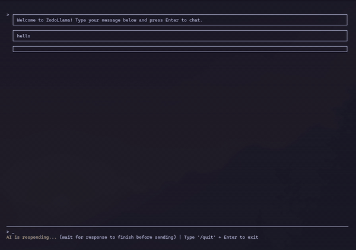

# ZodoLlama

A fast, lightweight terminal chat interface for local LLMs written in Zig. Supports Ollama and LM Studio with real-time markdown rendering.



## Quick Start

### Prerequisites

- **Zig** (0.15.2 or later)
- **LLM Provider**: Either **Ollama** or **LM Studio** running locally
- Any ANSI-compatible terminal

### Installation

```bash
# Option 1: Using Ollama (default)
ollama pull qwen3:30b  # Tested with qwen3:30b
ollama serve

# Option 2: Using LM Studio
# Start LM Studio GUI and load a model on port 1234

# Build and run ZodoLlama
zig build
./zig-out/bin/zodollama
```

## Features

- **Real-time streaming** with responsive, non-blocking UI
- **Markdown rendering** - Code blocks, tables, lists, and emoji
- **Tool calling** - 13 tools: read/write/edit files, search code, navigate directories, manage tasks
- **Experimental read file agent** - AI curates important file sections, reducing context
- **GraphRAG** - Automatic knowledge graphs compress context (experimental, optional)
- **Permission system** - Control tool access with persistent policies
- **Task management** - Track multi-step workflows
- **Thinking blocks** - See AI reasoning (toggle with `Ctrl+O`)
- **Interactive config editor** - Visual TUI for settings (type `/config`)
- **Mouse & keyboard controls** - Scroll, expand blocks, highlight text
- **Debug tools** - Toggle raw tool JSON with `/toggle-toolcall-json`
- **Configurable** - Customize model, host, and colors

## Usage

**Chat:**
- Type your message and press `Enter` to send
- Watch the AI response stream in real-time
- Scroll with mouse wheel to view history

**Controls:**

| Key/Action | Function |
|------------|----------|
| `Enter` | Send message |
| `Escape` | Clear input |
| `/config` + `Enter` | Open interactive config editor |
| `/quit` + `Enter` | Quit application |
| `/toggle-toolcall-json` + `Enter` | Toggle raw tool JSON visibility |
| Mouse wheel | Scroll messages (moves `>` cursor) |
| `Ctrl+O` | Expand/collapse message block at cursor (`>`) |
| `Shift+Click` | Highlight and copy text |

## Tool Permission System

Control AI access to tools (file read/write, search, tasks) with a permission prompt system.

**Options:** Allow Once (1), Session (2), Remember (3), or Deny (4)

Policies persist in `~/.config/zodollama/policies.json`. Some tools like file trees and searches are auto-approved; file writes require permission.

## Configuration

Config: `~/.config/zodollama/config.json` (created on first run)

**Provider Selection:**
```json
{
  "provider": "ollama",           // "ollama" or "lmstudio"
  "ollama_host": "http://localhost:11434",
  "lmstudio_host": "http://localhost:1234",
  "model": "qwen3-coder:30b"
}
```

**Key options:** `provider`, `model`, `ollama_host`, `lmstudio_host`, `num_ctx` (context window), `num_predict` (max tokens), `graph_rag_enabled`, `embedding_model`, `indexing_model`, `editor`, `scroll_lines`, and color settings.

**CLI overrides:** `--model`, `--ollama-host`

**Note:** Provider-specific features (Ollama's `think` mode, `keep_alive`) are gracefully handled - unsupported features are ignored by other providers.

## Platform Support

Linux (tested on x86_64), macOS. Windows not supported.

## Documentation

See [docs/](docs/README.md) for user guide, architecture, and development info.

## License

MIT License

---

<details>
<summary><strong>Technical Details</strong></summary>

**Architecture:**
- Multi-threaded streaming with thread-safe design
- Provider abstraction layer supporting multiple LLM backends (Ollama, LM Studio)
- Flicker-free rendering with smart viewport management
- Event-driven permission system with async tool execution
- Modular codebase (~12k lines of code, ~16k total with ZVDB integration)
- Separated concerns: Core app (1.4k lines), GraphRAG module (642 lines), rendering (1.2k lines), provider layer (700 lines)

**Markdown:** Headers, emphasis, links, lists, code blocks, tables, emoji

**History:** Evolved from ZigMark, a terminal markdown viewer

</details>
